# Aseity - Logic Flow Reference

**Purpose**: Visual pipeline documentation for all major features to ensure clarity and prevent future issues.

**Last Updated**: 2026-02-05

---

## Table of Contents

1. [Agent Lifecycle](#1-agent-lifecycle)
2. [Conversation Management](#2-conversation-management)
3. [Tool Execution Pipeline](#3-tool-execution-pipeline)
4. [Skillsets System](#4-skillsets-system)
5. [Web Crawl Feature](#5-web-crawl-feature)
6. [Error Handling & Recovery](#6-error-handling--recovery)
7. [TUI Event Loop](#7-tui-event-loop)
8. [Session Management](#8-session-management)

---

## 1. Agent Lifecycle

### 1.1 Agent Creation Flow

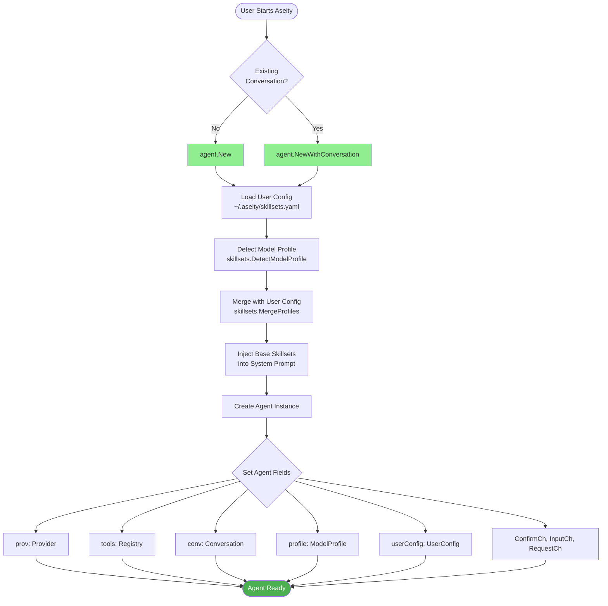

### 1.2 Agent State Preservation (Critical!)

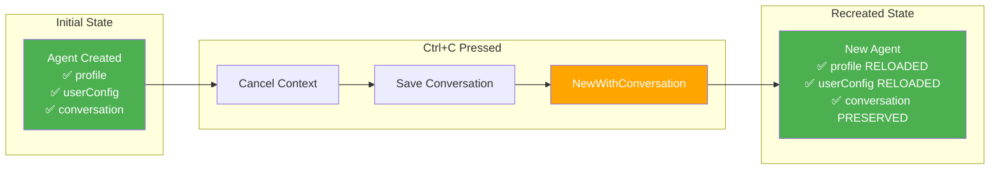

**Critical Code Path**:
```
File: internal/agent/agent.go:115-149
Function: NewWithConversation()
Must: Reload userConfig AND profile (fixed in commit d94aef5)
```

---

## 2. Conversation Management

### 2.1 Message Flow

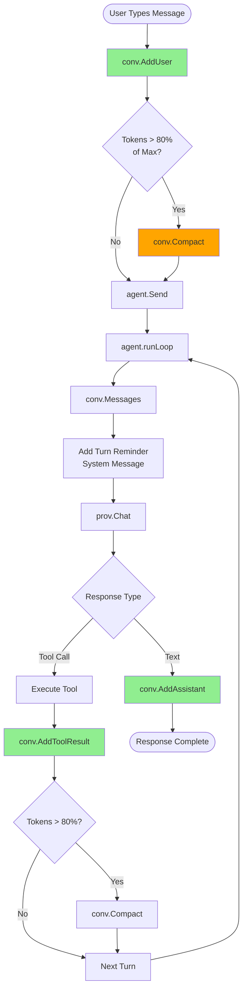

### 2.2 Context Window Management

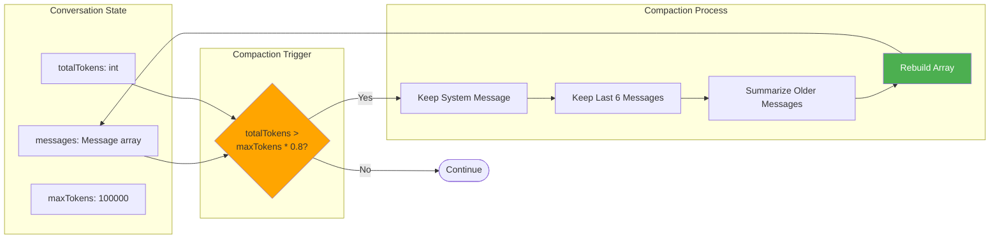

**Key Files**:
- `internal/agent/conversation.go:104-165`
- Compaction keeps last 6 messages (3 exchanges)
- Summarizes older messages to save tokens

---

## 3. Tool Execution Pipeline

### 3.1 Tool Call Flow

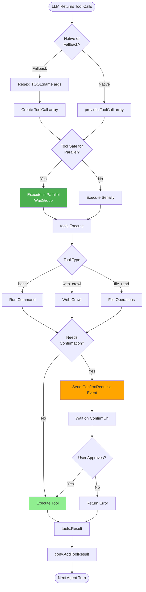

### 3.2 Parallel Execution Safety

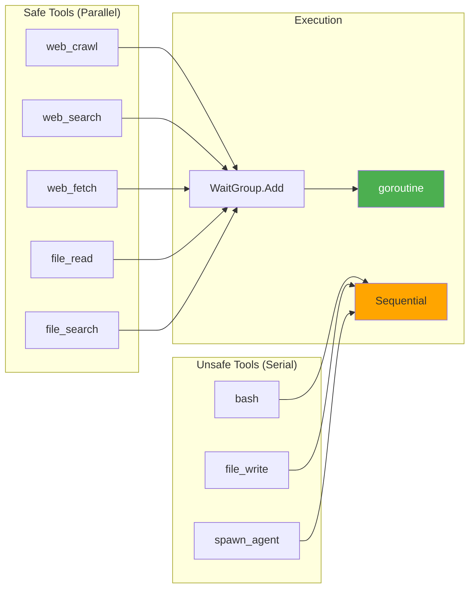

**Key File**: `internal/agent/parallel.go:4-13`

---

## 4. Skillsets System

### 4.1 Dynamic Skillset Injection

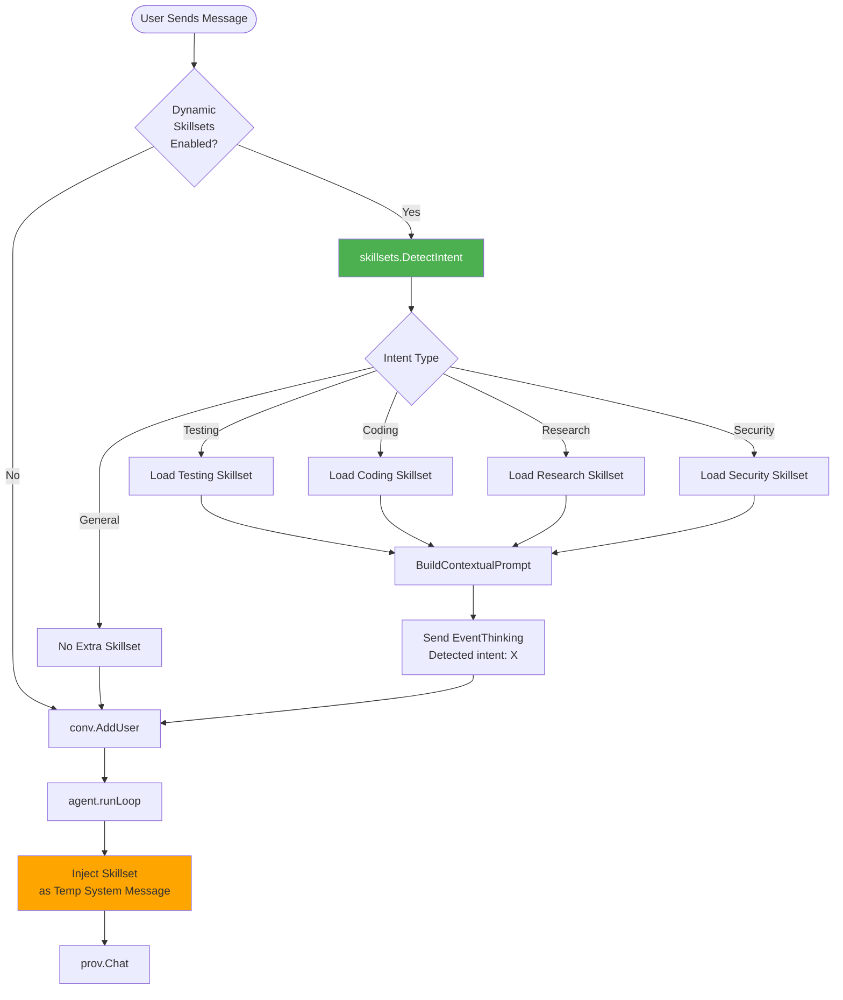

### 4.2 Intent Detection Logic

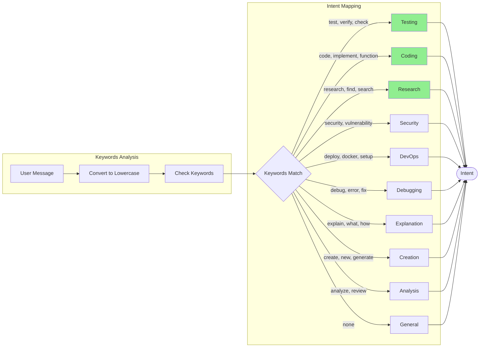

**Key File**: `internal/agent/skillsets/intent.go:14-103`

---

## 5. Web Crawl Feature

### 5.1 Web Crawl Decision Tree

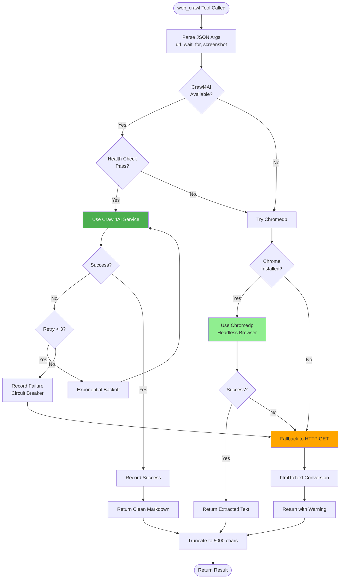

### 5.2 Crawl4AI Health Monitoring

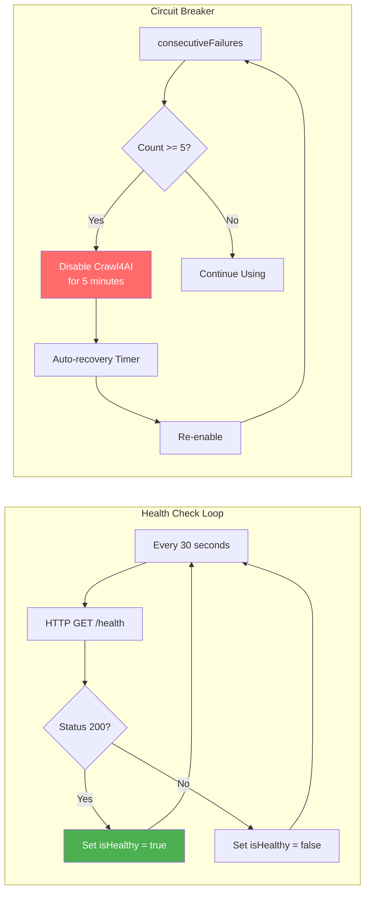

**Key Files**:
- `internal/tools/crawl.go:1-155`
- `docker-compose.yml:36-126` (Crawl4AI service)

---

## 6. Error Handling & Recovery

### 6.1 Error Propagation

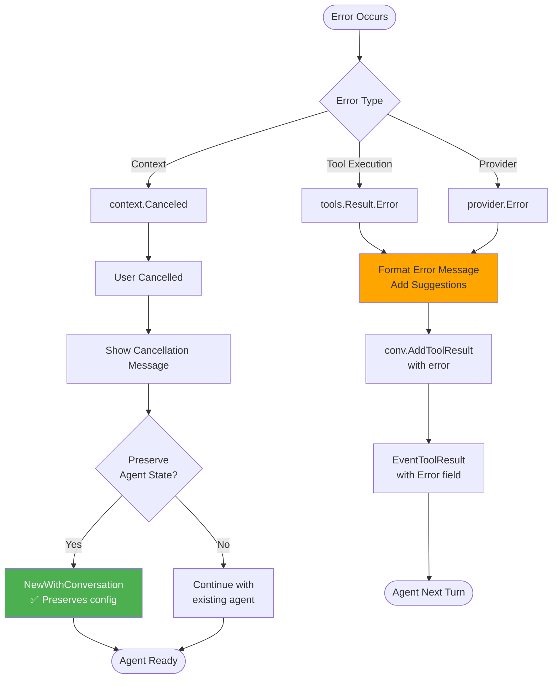

### 6.2 Graceful Degradation

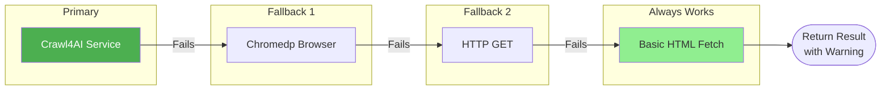

---

## 7. TUI Event Loop

### 7.1 Main Event Flow

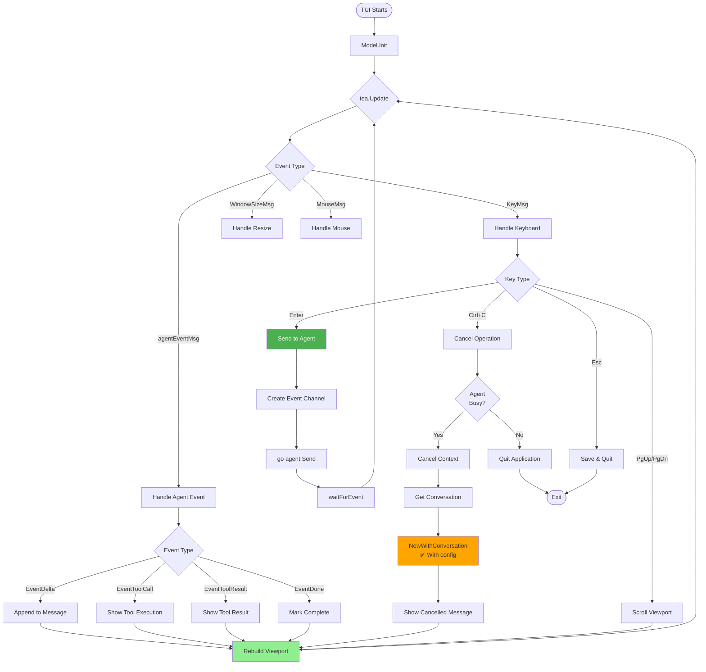

### 7.2 Agent-TUI Communication

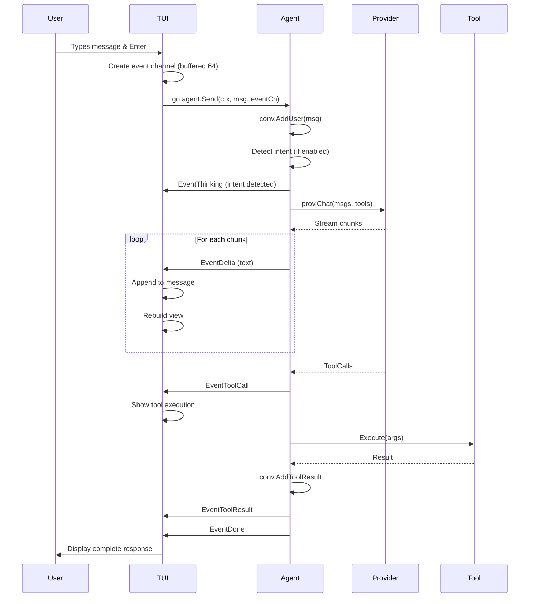

---

## 8. Session Management

### 8.1 Save & Restore Flow

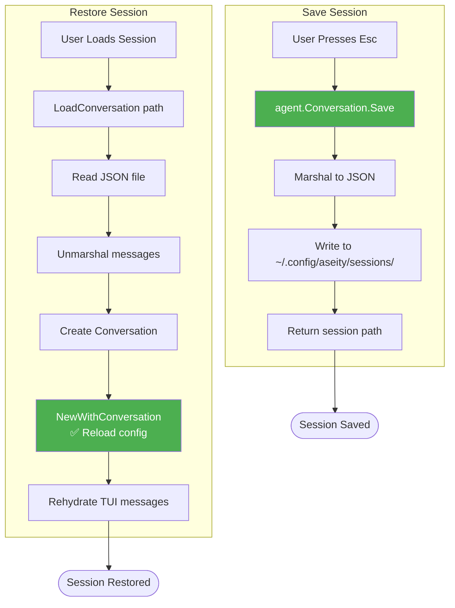

### 8.2 Data Persistence

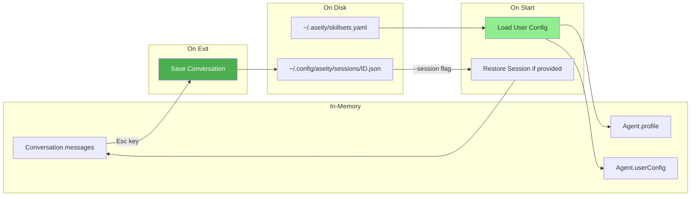

---

## Critical Code Paths Reference

### Must-Preserve State on Agent Recreation

**Location**: `internal/agent/agent.go:115-149`

```go
func NewWithConversation(prov, registry, conv) *Agent {
    // ✅ CRITICAL: Must reload these
    userConfig := skillsets.LoadUserConfig()
    profile := skillsets.DetectModelProfile(modelName)
    
    return &Agent{
        conv:       conv,        // ✅ Conversation
        profile:    profile,     // ✅ Skillsets
        userConfig: userConfig,  // ✅ User settings
        // ... other fields
    }
}
```

**Why**: Agent recreation happens on:
- Ctrl+C cancellation (`internal/tui/app.go:378-380`)
- Session restore (`internal/tui/app.go:218-220`)

**Impact if missing**: Agent loses skillsets, intent detection fails, context appears lost

---

### Conversation Compaction Threshold

**Location**: `internal/agent/conversation.go:106-110`

```go
func (c *Conversation) compactIfNeeded() {
    if c.totalTokens < c.maxTokens*80/100 {  // 80% threshold
        return
    }
    c.Compact()  // Keep last 6 messages, summarize rest
}
```

**Why**: Prevents context window overflow

**Tuning**: Adjust `80/100` ratio or message count in `Compact()` if needed

---

### Parallel Tool Execution Safety

**Location**: `internal/agent/parallel.go:4-13`

```go
func IsSafeToParallelize(name string) bool {
    switch name {
    case "web_crawl", "web_search", "web_fetch", "file_read", "file_search":
        return true  // Read-only operations
    default:
        return false  // Write operations must be serial
    }
}
```

**Why**: Prevents race conditions and data corruption

**Adding new tools**: Mark as parallel only if truly read-only

---

## Maintenance Checklist

When adding new features, ensure:

- [ ] Logic flow diagram created/updated
- [ ] State preservation verified (if agent recreation involved)
- [ ] Error handling paths documented
- [ ] Fallback mechanisms identified
- [ ] Critical code paths annotated
- [ ] Test scenarios documented

---

**Document Version**: 1.0  
**Last Updated**: 2026-02-05  
**Maintained By**: Development Team
